# Writer identification
We focus on process the writer identification task in Handwritten Chinese character recognition.
In this repository, we would not provide the training data, the data we obtained by online writing, and we will show it next.
# Data process
Each Handwritten Chinese character data is some 2D position recorded while the writer writing:
- Each stroke is some continues positions:

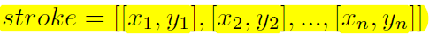

- Each character is organized by some stroks:
  
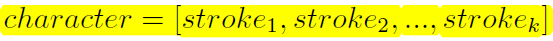

During our data collecting process, there always exsits some noise, like shown below:

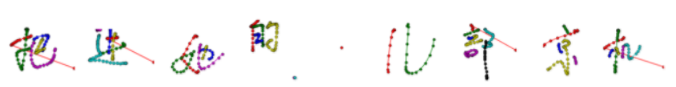

So we must take care of that, and try to find some regular pattern to make your dataset keep clean.

We refer to the paper "End-to-End Online Writer Identification With Recurrent Neural Network", and process our original data into RHSs(random hybrid strokes).
- Each RHS is a randomly sampled short sequence from the whole online data with both pen-down (real stroke) and pen-up (imaginary stroke) information.

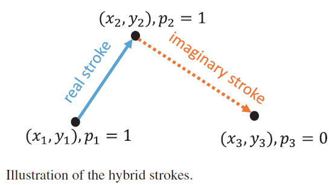

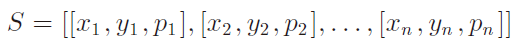

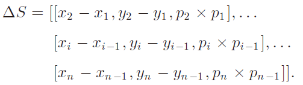

- Note that $\triangle S$ is a long sequence, to generate enough training data, we randomly sample multiple short **continuous** subsequences from $\triangle S$.

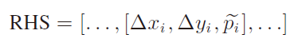

Also we have the position of each data, we could use images to do offline recognition.

# Model selection
In this part, we use CNN, LSTM, Bi-LSTM, Attention mechanism to do our writer identification task.
## CNN
Because in our dataset, for each writer, we just have 300 different characters, is hard to get a model without overfitting, or it may hard to find special features for our task.

In that case, we use VGG11-BN which pre-trained in ImageNet.

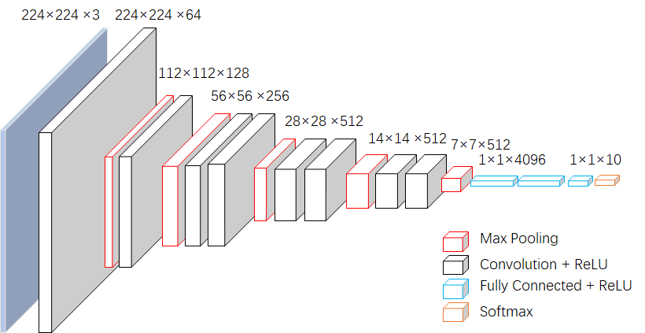

Also, we did data augumentation to get more image:

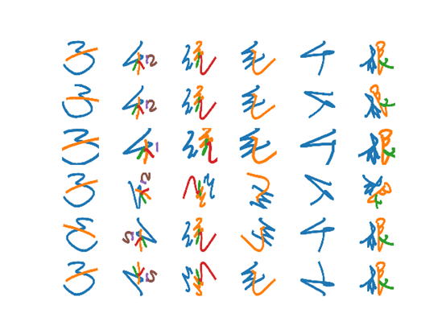

However... Like we expected, learning-based method may need more data to enhance their generalization ability. Although we did some image homography adapt, it can destroy the difference(eg. writing habits) among different writer, and since we normalize strokes' thickness and severity, it loss some useful information.

## LSTM & Bi-LSTM
In data process part, we have get enough RHSs, which contains a continuous timesteps $\triangle S$. Also, contexts from both past and future are useful and complementary to each other.

So we could use single direction LSTM and bidirectional LSTM to process RHSs, to automatically get each writer's feature encoder.

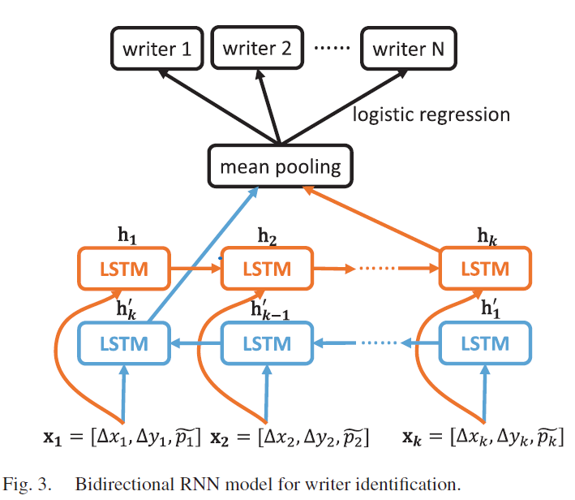

We use a full connection layer instead of mean pooling as our final classifier, and make decision with softmax.

The result shows, for single direction LSTM, the accuracy descend with more complex network, it may caused by gradient disappearance, as we just take out the last output, the deeper network could not learn useful feature contains long and short term.

## Attention
Another method to solve long-short term problem is to use attention mechanism to focus network's attention.

We use attention model replaced the classifier. And visualize the $\triangle S$ with higher weight:

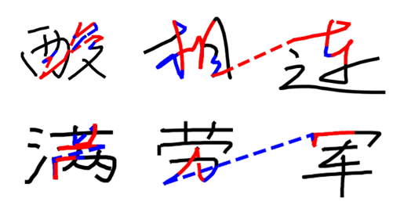

It shows...The imaginary strokes and some joined-up habits play important parts in writer identification.

# Test
We upload some test data in dataset, also with a test.py to have fun.
For each test data, we randomly choose 20 RHSs to make a probability ensemble decision, the confusion matrix is like below(is just about ten writers data):

Shows good separability in this task.

# Future Work
- We tried to find whether the RHSs timesteps could influence the result, from [10-100], the longer timesteps, the higher accuracy. *But* there must be a longest timesteps that LSTM could not work well. Since attention mechanism could help us focus on some special stroke, by combining these two model, we may find some interesting idea in super-long sequence task.
- Our data is almost clean. In real applications, the data could be more complex and need more cautious process.
